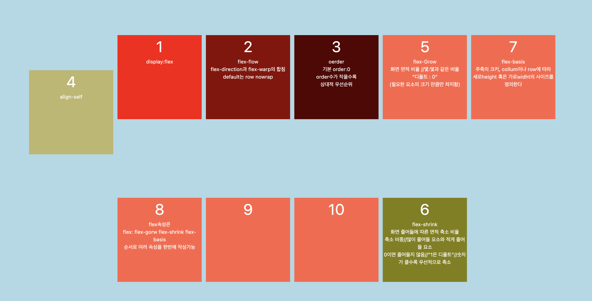
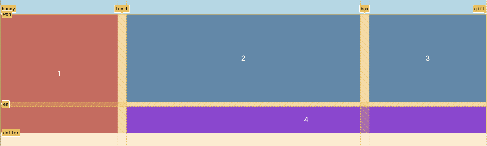
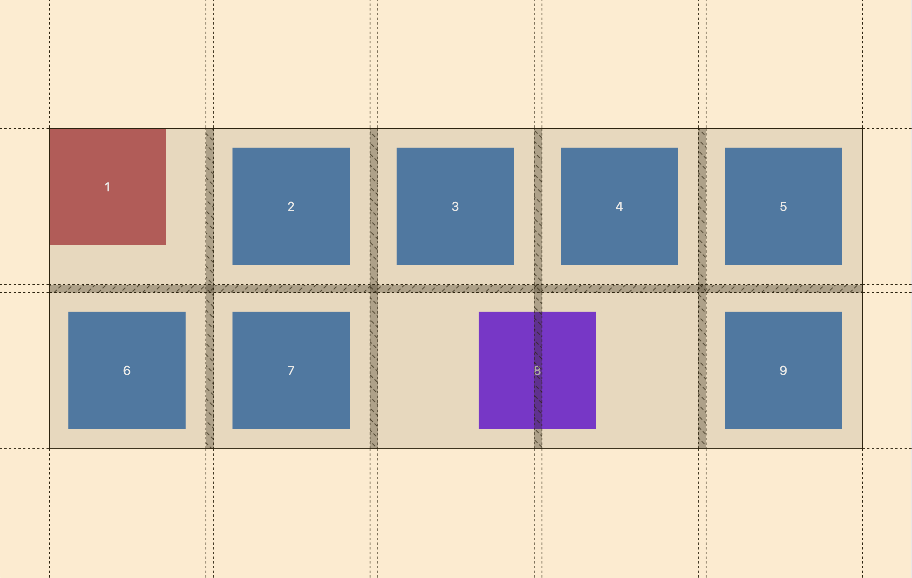

# CSS layout class

### CSS 스타일링의 두가지 방식을 배우고 각각의 속성을 활용하기

> - display: flex
> - display: grid

## ✅ flex



- `flex-direction` (default : row)
- `align-items`
- `justify-content`
- `flex-flow`
- `oerder` : 상대적 우선순위 (default: 0 / 수치가 작을수록 우선)
- `align-self`
- `flex-warp`
- `align-content`
- `flex` : flex-grow | flex-shrink | flex-basis
  <br/> | 요소 면적 확장 비율 (default: 0)
  <br/>| 요소 면적 축소 비율 (default: 1 / 0이면 줄어들지 않음 / 수치가 클수록 우선적으로 축소)
  <br/>| 주축의 크기 (max 또는 min으로 활용될 수 있음)

## ✅ grid


<br><br>

### 횡 / 열에 라인의 이름을 붙이는 법

- `grid-template-columns` : [happy] 1fr [lunch] 2fr [box] 1fr [gift]
- `grid-template-rows`: [won] 200px [en] 60px [doller]
  <br><br>
  | 그리드의 시작점/끝점 하나씩 지정하는 프로퍼티
- `grid-column(row)-start`: 2;
- `grid-column(row)-end`: -1;
  <br><br>
  | 그리드의 숫자, 이름으로 영역 선택하는 법
- `grid-row`: 1 / -1;
- `grid-column`: lunch / gift;
  <br><br>
  | span keywrod로 영역 선택하는 법
- `grid-row`: 1 / -1;
- `grid-column`: lunch / span 2;
  <br><br>
  | 그리드를 시각적으로 영역 세팅하는 프로퍼티
- `grid-template-areas`: "셀 명"
- `grid-template`: "셀 명" | grid-template-rows 높이 / grid-columns 너비;
  <br/>< 🔗 참고 링크>
  <br/>https://github.com/nomadcoders/css-layout-masterclass/commit/11367179c514e3f3b7e58a94c14d39e14b0cd973
  <br><br>
  | 그리드 Auto 설정 '부모 태그에 작성'
- `grid-template-colunms` : repeat(2, 1fr);
- `grid-template-rows` : repeat(2, 1fr);
  <br><br>
  | 지정되지 않은 셀의 기본값이 됨
- `grid-auto-rows` : 1fr;
- `grid-auto-columns` : 1fr;
  <br><br>
  | 추가 요소가 있으면 row(횡) column(열)로 생성되어야 한다는 의미 <br>
- `grid-auto-flow` : row (혹은 column) ;
  <br><br>

---

> 셀과 셀 내부 요소 정렬
> <br>



### 셀 내부의 요소 정렬하는 법

| 부모 태그에 item속성을 부여해서 셀 내부의 요소의 위치, 확장성 등을 조정(flex의 프로프티와 비슷)

- `justify-items` : stretch | center | start | end ;
- `align-items`: stretch | center | start | end ;
  <br>(\*stretch 속성을 부여하면 박스 요소의 사이즈가 지정되어 있지 않을 시 최대치로 확장되어 있음)
  <br>

| 자식 요소에 `align-self` / `justify-self` / `place-self(열 횡))`로 개별 요소 조정도 가능

### 셀 자체를 정렬

- `algin-content`: start | end | center | space-between | space-around ; (세로 영역/열)
- `justify-content`: start | end | center |; (가로 영역/횡)
- `place-content`: start end; (열 횡)

### 반응형

- `auto-fit` 최대한 많은 요소들을 배치. 남는 공간은 비워둠
- `auto-fill` 필요한 만큼 요소를 배치. 여백은 만들지 않는다.

```css
<사용 예문>
.grid_container {
  display: grid;
  grid-template-columns: [happy] 1fr [lunch] 2fr [box] 1fr [gift];
  grid-template-rows: [won] 200px [en] 60px [doller];
  row-gap: 10px;
  column-gap: 20px;
}

.grid_box:first-child {
  grid-row: 1 / -1;
  /* 라인 숫자로 영역 지정한 경우 */
}
.grid_box:last-child {
  grid-column: lunch / gift;
  /* 라인 이름으로 영역 지정한 경우 */
}


/* - case01 */
grid-template-areas: "셀 명";
grid-template-rows: 높이;
grid-template-columns: 너비;

/* - case02 */
grid-template : "셀 명"  grid-template-rows 높이 ;
                "셀 명"  grid-template-rows 높이 ;
                "셀 명"  grid-template-rows 높이 / grid-columns 너비;

⚠️ 위의 두 가지 경우 태그에 "셀 명 " 지정해줘야 함
.grid_box {
  grid-area: "셀 명";
}
```
